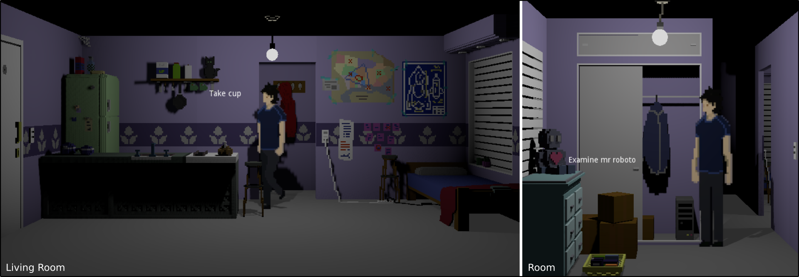

# Personal Godot



A port of the game [personal voxel](https://lunafromthemoon.itch.io/personal-rocket-demo) to the [Godot Engine](https://godotengine.org/). I will most probably not port the whole game, but just enough so I can learn how to properly use GODOT.

The main idea of creating this repo is so that the comunity can use it as an example on their own projects. Godot's documentation is currently not the best, and I was able to learn mostly thanks to other projects. So, as a way to say thanks, I am making my project public. I will try to write the code as clear as possible, while keeping good coding practices.

Currently, I have implemented:

## A Point and Click system.
You can point to something, and see its name alongside relevant actions. By clicking you will then perform the currently selected action. You can change actions using the mouse wheel.

There is no limit to the number of actions to be implemented or used on each object. However, we only show the relevant ones for each object. For example:

- Cup => Take, Examine
- Light Switch => Use
- Wardrobe => Open, Examine

In this way, we can make the player easily understand how it should be interacting with something, instead of going through every possible action trying to guess it.

The point and click is a *separate node*, which allows to separate the logic of the game (is this condition met to continue?), from the mechanics (use the mouse to perform actions) of the game.

## A finite-state-machine to control the actions of the subjects
We implement the logic of our characters as a FSM, this keeps both the logic and the code simple.

The states currently allow to: 
- AddToInventory
- Animate
- AnimateUntilFinished
- FaceObject
- PerformActionOnObject
- WalkPath

So, for example, "take(object)" translates into:

```
Animate("walk") => WalkPath(path_to(object)) => Animate("idle") =>
FaceObject(object) => AnimateUntilFinished("raise_hand") => PerformActionOnObject(take), AddtoInventory(object) => AnimateUntilFinished("lower_hand")
```

## Basic transitions between different areas
So far, the house has a living room and a room. When going from one place to the other, the camera and position of the player will change. This is implemented through the action "go_to".

## Voxel Art
Created using [MagicaVoxel](https://ephtracy.github.io/)

## Animations based on sprites
The game has a 3D world, with 2D characters. The animation of the characters is managed trough sprites.

## Tweening / Tween animation
An example on how to use Tweening is implemented to open the wardrobe.

## A 3D Navigation Mesh (Navmesh).
When "walking to" something, a path will be created using the Navigation system of Godot. Which I was able to understand mostly thanks to [this example](https://github.com/godotengine/godot-demo-projects/tree/master/3d/navmesh)

## A Baked Light Map
To try to keep things performant. I learned how to do this thanks to the [following video](https://www.youtube.com/watch?v=R0y9Li0qBbI)

## Light changes
The lights can be turned on or off.
